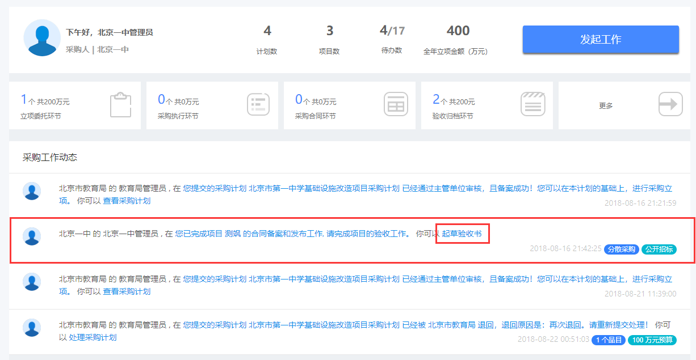

# 我的工作台

## 顶部操作栏

您登录之后，首页会显示如下图所示的操作栏，从左到右依次是：系统logo、搜索栏、操作按钮栏以及我的个人信息栏。



其中，点击小房子可以随时回到我的工作台首页。


点击我的个人信息，即单位名称-用户名称，可以选择退出系统。


## 帮助菜单

在您使用系统遇到问题之后，可以点击右侧的悬浮窗口，打开帮助菜单，查看相关的解决方案，里面会有详尽的操作手册，帮助您解决遇到的问题，提供引导！




如果您遇到特殊的问题，无法找到解决方案，请随时联系我们！


## 工作台欢迎页面

欢迎页面及我的简要信息统计页面，分别从不同的角度，统计您所在单位今年的采购情况，如采购计划、采购项目，待办情况等。


```
上半部分围绕整体的采购情况，下半部分围绕采购项目的统计情况，按阶段统计所有项目当前的状态：
立项委托：包含了当前处于采购立项状态和采购委托状态
采购执行：包含了代理机构在执行环节的各类状态，如发布采购公告，发布结果公告等
采购合同：包含了采购人与供应商签订合同的阶段
验收归档：包含了当前处于验收阶段和归档阶段的环节
```


点击任何一个对应的阶段，即可跳转到相应的项目列表，方便您即时查看相关的项目信息。


## 我的采购工作动态

我的采购工作动态，也称为待办工作，所有需要您进行处理的工作内容，都会及时的出现在列表中，工作任务一览无余，方便您跟踪您的工作进度。

主要向您推送的工作内容有：

> 下级上报的待审核的采购计划或者采购项目

> 您填报，但是上级退回的采购计划或者项目

> 代理机构填报了采购结果，需要您进行确认的情况

> 以及合同、验收等环节的待办内容。



点击待办的最后操作按钮，即可便捷的处理此条待办


## 我的进行中的采购项目

此处显示您所有正在进行中的采购项目，即完成立项提交审核之后，到验收完毕的所有项目，都会显示在这里。同时，根据此处显示的项目，还会同时显示采购项目所对应的采购计划、和采购预算信息，以分栏分列表的形式展现，能以一条完整的线，展现您所有的资金预算使用情况。



点击项目名称，即可查看项目的详细信息。




蓝色的进度条表示当前进行到哪个环节，灰色的表示还未开始的环节


