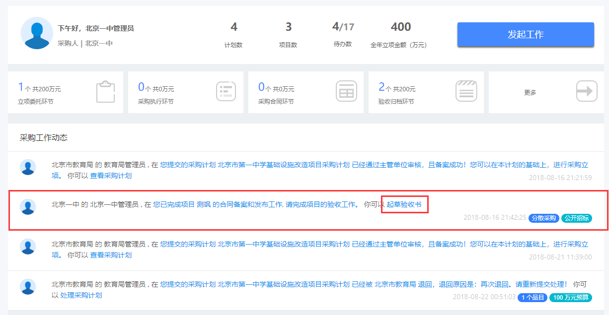

# 我要进行采购项目验收

## 如何进入验收环节？

登录系统，我的工作动态列表中，会出现一条验收项目的动态，点击“起草验收书”，进入验收环节，如图一。

## 如何进行项目验收？

### 查看项目信息


项目详细信息可以折叠/展开。



采购结果信息可以折叠/展开。


###  起草履约验收

#### 验收基本信息及货物清单信息

1. 选择验收的供应商或者服务；
2. 选择完验收的供应商或者服务后，验收清单会自动加载对应数据（初始时为空）；
3. 填写 验收书标题、 合同名称、 合同编号并选择 验收形式
4. 验收形式为【有第三方机构参与】时，需填写  第三方机构名称。


带红 “\*” 为必填项。


#### 验收结果信息及验收人信息

1. 填写 验收结果详细信息： 验收具体内容、质量检测机构意见、验收结论性意见、履约验收地点、填写 验收专家名单、采购单位代表、代理机构负责人；
2. 填写  联系人信息 ： 采购人经办人、 采购人联系电话、 采购人手机号码
3. 上传  验收附件


带红 “\*” 为必填项。


### 提交验收履约书

验收信息填写完成后，点击【提交验收履约书】按钮，进行提交。

